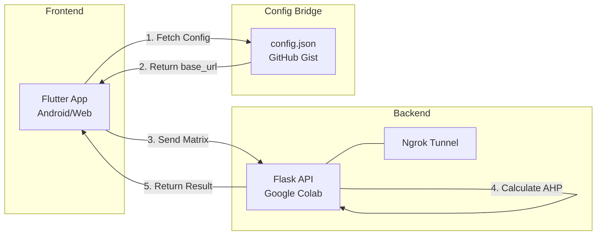

# 🌾 Agro-AHP Pro

**Sistem Pendukung Keputusan Pemeliharaan Mesin Berbasis Microservices**


Platform berbasis AHP (Analytical Hierarchy Process) untuk membantu manajer pemeliharaan di pabrik agroindustri menentukan prioritas perbaikan mesin secara matematis dan konsisten.

## 👤 Identitas

- **Nama Mahasiswa**: Muhammad Ikbal Maulana
- **Studi Kasus**: Pabrik Tepung Tapioka
- **Holding Company**: TIP Holding Company

### Kriteria Penilaian Khusus Tapioka
1. **Derajat Putih** - Tingkat kecerahan dan kebersihan tepung
2. **Pemakaian Air** - Efisiensi penggunaan air produksi
3. **Limbah Padat** - Volume limbah yang dihasilkan
4. **Efisiensi Produksi** - Kecepatan dan output produksi

### Alternatif Mesin
1. Mesin Parut (singkong → bubur)
2. Mesin Pencuci (pembersihan & pemisah kotoran)
3. Mesin Ekstraksi (ekstraksi pati dari bubur)
4. Mesin Pengering (dewatering)
5. Mesin Pengering Akhir (dryer tepung)

## 🏗️ Arsitektur Sistem



### Komponen Sistem

| Komponen | Teknologi | Fungsi |
|----------|-----------|--------|
| **Backend** | Python + Flask + NumPy | Komputasi algoritma AHP, eigenvector, CR |
| **Tunneling** | Ngrok | Expose localhost Colab ke internet |
| **Config Bridge** | GitHub Gist | Dynamic API URL discovery |
| **Frontend** | Flutter + Dart | UI mobile & input perbandingan |
| **Visualization** | fl_chart | Bar chart hasil ranking |

## 📂 Struktur Proyek

```
ASPK/
├── backend/
│   ├── ahp_backend.ipynb      # Google Colab notebook
│   └── README.md              # Dokumentasi backend
├── frontend/
│   ├── ahp_mobile/
│   │   ├── lib/
│   │   │   ├── main.dart
│   │   │   ├── models/
│   │   │   │   └── ahp_model.dart
│   │   │   ├── services/
│   │   │   │   └── api_service.dart
│   │   │   ├── screens/
│   │   │   │   ├── splash_screen.dart
│   │   │   │   ├── setup_screen.dart
│   │   │   │   ├── comparison_screen.dart
│   │   │   │   └── result_screen.dart
│   │   │   └── widgets/
│   │   │       └── comparison_slider.dart
│   │   ├── pubspec.yaml
│   │   └── ...
│   └── README.md              # Dokumentasi frontend
└── README.md                  # Dokumentasi ini
```

## 🚀 Quick Start

### 1. Setup Backend (Python)

1. Buka [Google Colab](https://colab.research.google.com/)
2. Upload file `backend/ahp_backend.ipynb`
3. Jalankan semua cell (Runtime → Run all)
4. Copy URL Ngrok yang muncul (contoh: `https://xxxx.ngrok-free.app`)

### 2. Setup Config Bridge (GitHub Gist)

1. Buka [gist.github.com](https://gist.github.com)
2. Buat New Gist dengan nama file: `config.json`
3. Isi dengan:
   ```json
   {
     "base_url": "https://xxxx-xx-xxx-xxx-xx.ngrok-free.app"
   }
   ```
4. Klik **Create public gist**
5. Klik tombol **Raw**
6. Copy URL Raw tersebut

### 3. Setup Frontend (Flutter)

1. Edit `frontend/ahp_mobile/lib/services/api_service.dart` baris 7:
   ```dart
   static const String gistRawUrl = 'PASTE_RAW_URL_GIST_ANDA_DI_SINI';
   ```

2. Install dependencies:
   ```bash
   cd frontend/ahp_mobile
   flutter pub get
   ```

3. Jalankan aplikasi:
   ```bash
   flutter run
   ```

## 📱 Cara Penggunaan

### Step 1: Buka Aplikasi
- Aplikasi otomatis fetch config dari Gist
- Health check koneksi ke Python API
- Jika berhasil, navigasi ke Setup Screen

### Step 2: Review Setup
- Lihat daftar kriteria (4 items)
- Lihat daftar alternatif mesin (5 items)
- Klik "Mulai Perbandingan Berpasangan"

### Step 3: Perbandingan Kriteria
- Tab "Kriteria"
- Bandingkan setiap pasang kriteria (6 perbandingan)
- Geser slider ke kanan/kiri
  - **Kanan** = Item1 lebih penting
  - **Kiri** = Item2 lebih penting
  - **Tengah (1)** = Sama penting

### Step 4: Perbandingan Alternatif
- Pindah ke tab berikutnya (4 tab untuk 4 kriteria)
- Setiap tab: bandingkan 5 mesin (10 perbandingan)
- Total: 6 + (4 × 10) = **46 perbandingan**

### Step 5: Hitung & Lihat Hasil
- Klik "Hitung Hasil AHP"
- Server kalkulasi eigenvector & CR
- Jika **CR < 0.1**: Lihat ranking
- Jika **CR ≥ 0.1**: Input ulang (tidak konsisten)

## 🧮 Algoritma AHP

### Tahapan Perhitungan

1. **Input Matrix Perbandingan Berpasangan**
   - Skala Saaty 1-9
   - Property: Reciprocal (jika A:B = 3, maka B:A = 1/3)

2. **Hitung Eigenvector (Bobot)**
   ```
   Geometric Mean: GM[i] = (∏ matrix[i][j])^(1/n)
   Normalisasi: Weight[i] = GM[i] / ∑GM
   ```

3. **Hitung λmax**
   ```
   Weighted Sum Vector: WSV = Matrix × Weights
   λ[i] = WSV[i] / Weights[i]
   λmax = average(λ)
   ```

4. **Uji Konsistensi**
   ```
   CI = (λmax - n) / (n - 1)
   CR = CI / RI[n]
   ```
   
   **Syarat**: CR < 0.1

5. **Sintesis Global**
   ```
   Global_Score[alternatif] = ∑(Criteria_Weight[i] × Alt_Weight[i])
   ```

### Random Index (RI)

| n | 1 | 2 | 3 | 4 | 5 | 6 | 7 | 8 | 9 | 10 |
|---|---|---|---|---|---|---|---|---|---|----|
| RI | 0 | 0 | 0.58 | 0.90 | 1.12 | 1.24 | 1.32 | 1.41 | 1.45 | 1.49 |

## 🔧 Build & Deployment

### Build Android APK

```bash
cd frontend/ahp_mobile
flutter build apk --release
```

Output: `build/app/outputs/flutter-apk/app-release.apk`

### Upload ke GitHub Releases

```bash
# Tag versi
git tag -a v1.0.0 -m "Release version 1.0.0"
git push origin v1.0.0

# Upload APK ke Releases tab di GitHub
```

### Deploy Flutter Web (Opsional)

```bash
flutter build web --release
```

Upload folder `build/web` ke Vercel/Netlify.

**⚠️ Catatan**: Pastikan CORS enabled di backend!

## 🧪 Testing

### Test Backend API

```bash
curl -X POST https://your-ngrok-url.ngrok-free.app/api/calculate \
  -H "Content-Type: application/json" \
  -d '{
    "criteria": ["C1", "C2"],
    "alternatives": ["A1", "A2"],
    "criteria_matrix": [[1, 3], [0.333, 1]],
    "alternative_matrices": {
      "C1": [[1, 2], [0.5, 1]],
      "C2": [[1, 3], [0.333, 1]]
    }
  }'
```

### Test Gist Config

```bash
curl https://gist.githubusercontent.com/USERNAME/GIST_ID/raw/config.json
```

## 🐛 Troubleshooting

### Backend tidak bisa diakses
- ✅ Pastikan Colab notebook sedang running
- ✅ Cek Ngrok URL sudah benar di Gist
- ✅ Pastikan cell Ngrok sudah dijalankan

### Flutter error CORS
- ✅ Backend sudah `CORS(app)` enabled
- ✅ Test dengan Postman dulu sebelum Flutter

### Consistency Ratio > 0.1
- ✅ Penilaian user bertentangan
- ✅ Contoh salah: A>B (5), B>C (5), C>A (5)
- ✅ Solusi: Review dan ubah perbandingan

### APK tidak bisa install
- ✅ Enable "Install from Unknown Sources"
- ✅ Pastikan build dengan `--release` flag

## 📊 Screenshots

*(Tambahkan screenshot setelah aplikasi berjalan)*

- [ ] Splash Screen
- [ ] Setup Screen
- [ ] Comparison Screen
- [ ] Result Screen dengan Chart

## 🎥 Video Demo

*(Link ke video demo 3-5 menit)*

Requirements:
- ✅ Input data di HP
- ✅ Proses kalkulasi
- ✅ Hasil ranking muncul
- ✅ Bukti dari server (bukan hardcode)

## 📚 Referensi

- Saaty, T. L. (1980). *The Analytic Hierarchy Process*. McGraw-Hill.
- [Flutter Documentation](https://docs.flutter.dev/)
- [NumPy Documentation](https://numpy.org/doc/)
- [Flask Documentation](https://flask.palletsprojects.com/)

## 📄 Deliverables Checklist

- [x] Backend: Google Colab notebook dengan Flask + Ngrok
- [x] Frontend: Aplikasi Flutter lengkap
- [x] Config Bridge: GitHub Gist setup
- [ ] APK Release: Build dan upload ke GitHub
- [ ] README: Dokumentasi lengkap (file ini)
- [ ] Screenshots: Tampilan aplikasi
- [ ] Video Demo: Rekaman penggunaan aplikasi
- [ ] Testing: Validasi end-to-end

## 👨‍💻 Author

**Muhammad Ikbal Maulana**  
Pabrik Tepung Tapioka  
TIP Holding Company

---

© 2026 Agro-AHP Pro - Sistem Pendukung Keputusan Pemeliharaan
